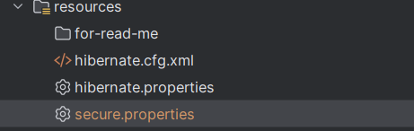
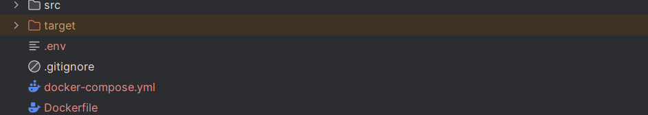

# Patient management app

This patient management app is made with Java Enterprise Edition with JakartaEE framework.

## Main functionalities:

A user that do not have an account can have access to all patient list without details.
We just have to create an account to get an account, in this case we'll be able to make CRUD operations ( add a patient, delete a consultations etc ...)

## How it's work ?

The app generate a .war file, which need an external server to be deployed (Tomcat in our case).
In the DockerFile, we make sur to use Maven to get the war file with bytes files, which is copied and pasted into tomcat.

## How to start this project ?

You have to use Docker to deploy locally the app, you must follow those simple steps below :

1. add "secure.properties" file in the resources package :



add this inside of it (  be free to replace existing data  ) : 

```
hibernate.connection.username = myuser
hibernate.connection.password = 1234

```

2. add ".env" file for docker-compose.yml ( be free to replace existing data )



add this inside of it (  be free to replace existing data  ) :


```
DB_HOST=db
DB_PORT=3306
DB_NAME=patients_db
DB_USER=myuser
DB_PASSWORD=1234
TOMCAT_PORT=8080
MYSQL_DATABASE=patients_db
MYSQL_USER=myuser
MYSQL_PASSWORD=1234
MYSQL_ROOT_PASSWORD=1234
MYSQL_PORT=3306
PMA_HOST=db
PMA_PORT=3306
MYSQL_ROOT_PASSWORD=1234
PMA_PORT=8081


```


3. open Docker desktop to get docker deamon

4. run in your terminal "docker-compose up --build"

5. see you at "http://localhost:8080/patients-jee" !
